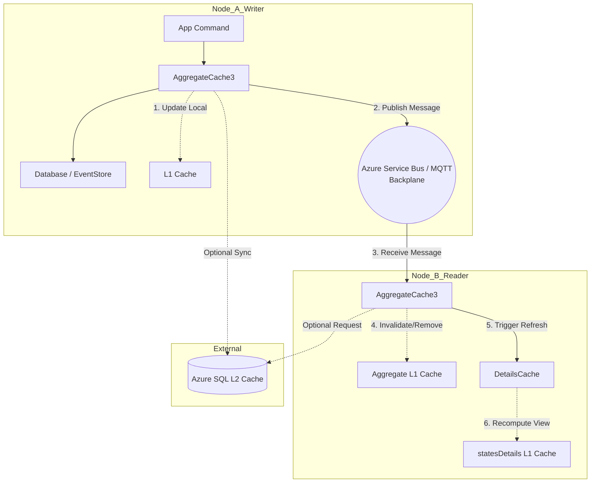

# Advanced Caching Architecture

Reconstituting an aggregate state from a long stream of events can be costly if done for every command or read request. Sharpino implements an advanced, multi-tiered caching architecture to handle this, ensuring both blazing-fast reads and strict consistency across distributed nodes.

## The Refreshable Details Cache

Detail views are implemented using a `Refreshable<'A>` or `RefreshableAsync<'A>` interface. Because they depend on Aggregate states, Sharpino tracks these dependencies. The Detail Cache received a massive boost by utilizing async, task-based refreshable details. 

When an Aggregate produces a new event, the system immediately and asynchronously triggers a refresh (`RefreshDependentDetails`) on all Details that depend on that specific Aggregate ID. This ensures the high-performance read models never drift from the Event Store.

## L1, L2, and the Message Backplane

To support horizontal scaling, Sharpino instruments its cache layers with an **L2 Cache** and a **Message Backplane**.

- **L1 Cache (In-Memory)**: A localized, ultra-fast cache holding reconstructed Aggregates and active Detail closures.
- **L2 Cache (SQL/Azure SQL)**: A distributed cache layer that shares easily serialized data across nodes. 
- **Message Backplane**: To prevent nodes from serving stale L1 data, Sharpino uses a backplane (Azure Service Bus or MQTT). When Node A updates an aggregate, it broadcasts an invalidation message over the backplane. Node B receives this, instantly invalidates its stale L1 cache, and automatically triggers its local `RefreshDependentDetails` process.

### Synchronization Flow

