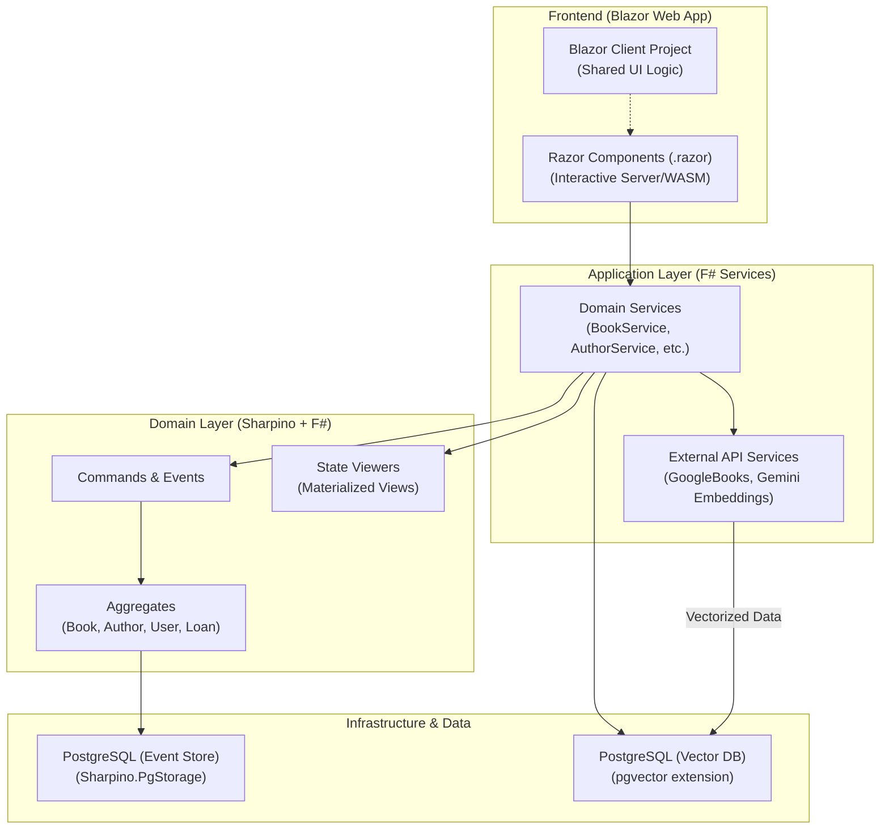

# Application Layer & Frontend Integration

One of the great strengths of Sharpino is that while the core domain and event-sourcing mechanics are built using strict functional F#, it is incredibly easy to integrate with a robust C# frontend.

## C# and F# Interoperability

Integrating a C# (Blazor) frontend with an F# Sharpino backend is highly feasible and extremely powerful. The integration friction is exceptionally low. 

Most integration tasks simply involve establishing thin mapping layers. For example, converting standard F# `list` types emitted by the detail views into standard C# `List<T>` or `IEnumerable<T>` structures that Blazor components (like `QuickGrid`) can comfortably consume.

## Architecture Blueprint: BlazorBookLibrary

The `blazorBookLibrary` project serves as the definitive blueprint for this architecture. It cleanly separates the Interactive Blazor Server/WASM frontend from the strict F# CQRS domain.

By leveraging this separation of concerns, developers get the best of both worlds: the rich ecosystem and UI capabilities of C# Blazor, underpinned by the bulletproof reliability and testability of an F# event-sourced domain.
